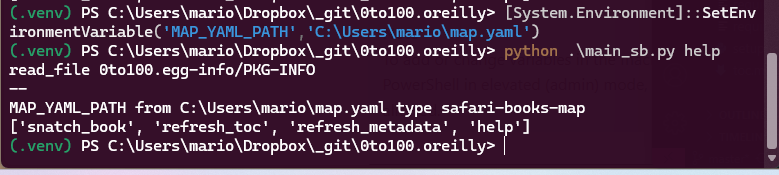
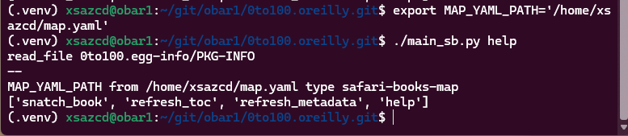

# 0to100.oreilly

`0to100` for https://learning.oreilly.com/

> more info on the git repo [here](https://github.com/obar1/0to100)


## toc 🚀

all book metadata [here](./toc.md)

##  drop box sync

> idea is to have this sync on dropbox and under git but we want to  avoid to push to git the copyrighted materials ( pdf and epub )

### setup

- create an empty folder with the name of trhe repo

- ignore it 
ex
```ps1
Set-Content -Path '0to100.oreilly' -Stream com.dropbox.ignored -Value 1
```
- do git clone of the repo
> if not exclude git start to have issues as git clone drive dropbox a bit crazy :P

- exclude from dropbox sync the `.git` folder

ex
```ps1
Set-Content -Path '.venv' -Stream com.dropbox.ignored -Value 1
Set-Content -Path '.git' -Stream com.dropbox.ignored -Value 1
``` 

- for each 978x folder rememebr to haev the proper gitignore setup and add `sync to dropbox` from the UX if necessary

## sharing

use

```ps1
[System.Environment]::SetEnvironmentVariable('MAP_YAML_PATH','$HOME\map.yaml')
```


or  
> if you are like to use mac/linux 

```bash
export MAP_YAML_PATH='~/map.yaml'
```

